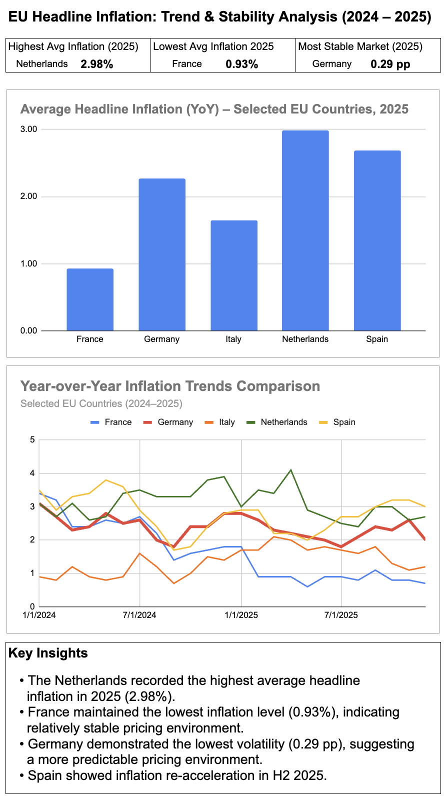

# EU Headline Inflation: Trend & Stability Analysis (2024–2025)

## Overview
This project analyzes headline inflation trends across selected EU economies (France, Germany, Italy, Netherlands, Spain) for 2024–2025.

The analysis focuses on:
- Average inflation level (2025)
- Inflation volatility (standard deviation)
- Market pricing stability

## Dashboard Preview

